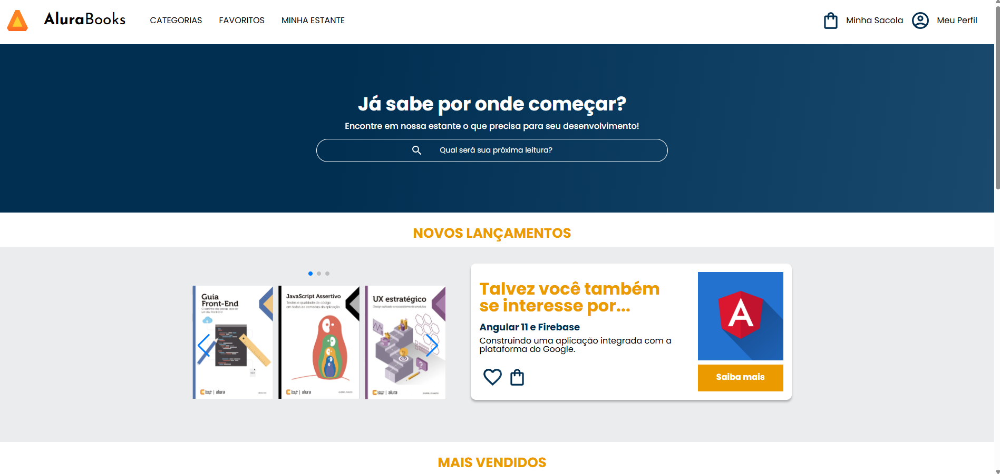

# AluraBooks

Projeto sobre responsividade.  

---

## Ferramentas utilizadas:  

- HTML  
- CSS
- Flex-box

## Aprendizado:

-Header responsivo com menu hambúrguer e menu de categorias.
-Banner e inputs com imagens de fundo usando apenas CSS.
-Carrossel via biblioteca externa.
-Cards e seções (mais vendidos, tópicos recentes, contatos) aplicando Flexbox.
-Footer detalhado com múltiplas listas.
-Media queries para layouts tablet e desktop, garantindo responsividade.
-Integração com Figma para ajustes de design.  

---

## Feito por:  
**Cristiane Koginski**  
